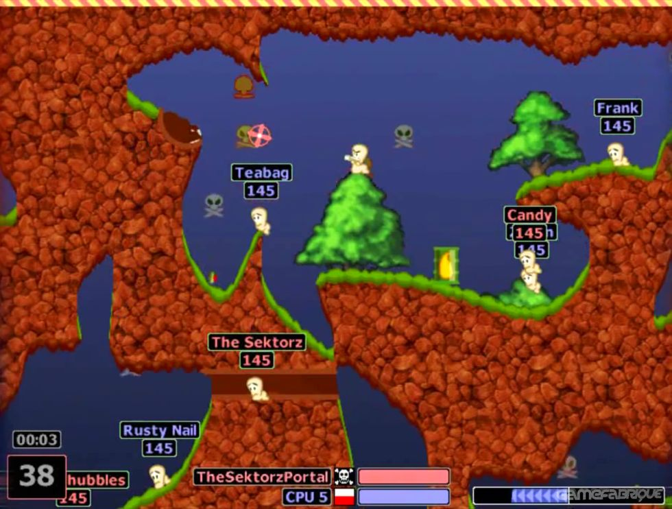

# Larvas: una copia del worms en PICO-8

Larvas (un demake de worms) © 2024 by Taller de Videojuegos TIP 2024 is licensed under Creative Commons Attribution-NonCommercial 4.0 International

## Introducción

Vamos a hacer un demake de Worms en Pico-8 para probar algunos conceptos interesantes. La idea es que se pueda jugar un juego similar al worms en Pico-8.

## Mecánicas

Es un juego de plataformas lateral por turnos dónde un equipo de larvas ataca a otro equipo de larvas utilizando artillería que se ve afectada por la gravedad y el viento.

## Material de referencia





## Alcance

Tener funcional una pantalla dónde dos equipos de larvas, controlados por personas de forma local, puedan competir entre ellos. Los equipos de larvas deben estar compuestos por 4 larvas cada uno, con nombres aleatorios. Al inicio del partido se ubican de forma aleatoria en el terreno. Al menos debe existir la bazooka como arma.

## Hitos

 - [x] Armado de repositorio / proyecto.
 - [x] Generar documento de diseño.
 - [x] Poder disparar en distintos ángulos. (Sistema vectorial de movimiento).
 - [x] La larva debe poder caminar.
 - [ ] La bala debe ser afectada por la gravedad, la fricción y el viento. (Motor físico inercial)
 - [ ] La larva debe poder saltar.
 - [ ] Gestión de turnos y equipos.
 - [x] Terreno.
 - [x] Control de cámara.
 - [ ] Generación de terreno aleatoria.
 - [ ] Terreno destruíble.

## Ejemplo de código

```lua
function _init()
    printh "Hola desde larvas"
end

function _update()
end

function _draw()
end
```
